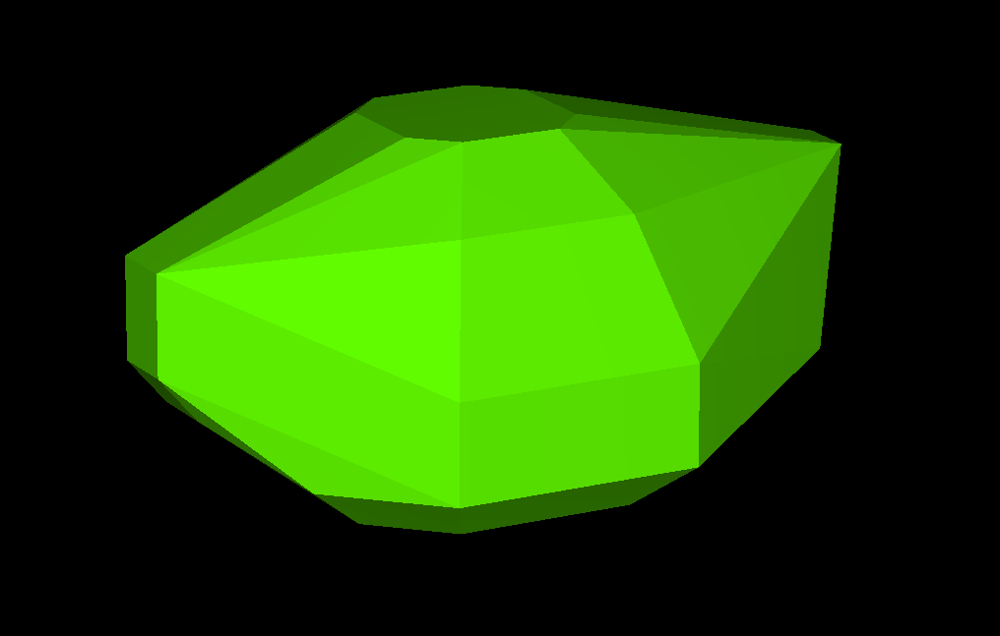

# 3D Convex Hull

This is an implementation of the O(n^2) 3D convex hull algorithm. Given a point cloud, it constructs the smallest convex polyhedron containing all input points.This implementation is designed to be very compact and easy to understand.

To use this program, just click the button to load points, and choose a file with extension .xyz. Try the examples from [here](https://people.math.sc.edu/Burkardt/data/xyz/xyz.html). You can zoom in/out with mouse wheel, and use left/right click to rotate.

